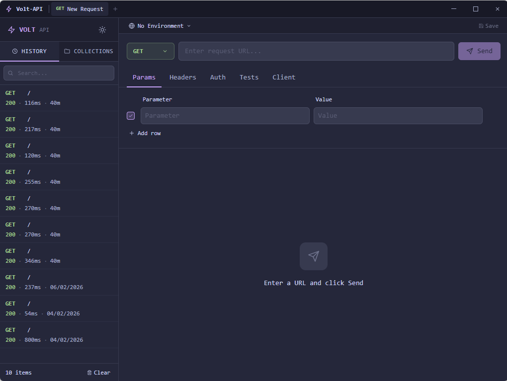

# Volt API

A high-performance, cross-platform API client built with Go, React, and Rust/WASM. Fast, lightweight, and designed for developers who live in their IDE.

> **No Electron. No bloat. Under 20MB.**



---

## Features

### Core
- **Full HTTP support** — GET, POST, PUT, DELETE, PATCH, HEAD, OPTIONS
- **Multiple tabs** — work on several requests at once
- **Request history** — every request saved locally with search and relative timestamps
- **Response streaming** — progress indicator for large payloads

### Request Builder
- **Headers editor** — key-value pairs with enable/disable toggles
- **Query params** — bidirectional sync with the URL bar
- **Auth** — None, Basic Auth, Bearer Token, API Key (header or query)
- **Body types** — JSON, Form Data, Raw, None
- **Pretty-print** — format JSON body with one click

### Response Viewer
- **Body tabs** — Pretty, Raw, Preview (HTML rendered in iframe)
- **Metadata** — status code (colour-coded), timing (ms), size (KB)
- **Headers & Cookies** — parsed and displayed in a table
- **Copy to clipboard** — copy the full response body instantly
- **Binary handling** — images rendered inline, other binary files shown as download

### Collections
- Create folders to organise requests
- Drag and drop requests into collections
- Rename, delete, move between collections via context menu
- **Export / Import** as JSON — share collections with your team

### Environments & Variables
- Create environments (Dev, Staging, Prod, …)
- Use `{{variable}}` syntax anywhere — URL, headers, body
- Switch environments from the toolbar
- **Import / Export** environments as JSON

### Advanced
- **Response assertions** — assert on status code, body content, headers, timing
- **Chained requests** — extract values from a response and use them in the next request
- **SSL settings** — skip verification, custom client certificates
- **Proxy support** — per-request proxy configuration
- **Timeout & redirect** — configurable per request

### UX
- **Catppuccin theme** — Dark (Macchiato) and Light (Latte) with a toggle
- **Resizable sidebar**
- **Keyboard shortcuts** — see table below
- **About dialog** — version info and branding

---

## Keyboard Shortcuts

| Action | Windows / Linux | macOS |
|--------|----------------|-------|
| Send request | `Ctrl + Enter` | `⌘ + Enter` |
| Save to collection | `Ctrl + S` | `⌘ + S` |
| Open environment manager | `Ctrl + E` | `⌘ + E` |
| New tab | `Ctrl + T` | `⌘ + T` |
| Close tab | `Ctrl + W` | `⌘ + W` |
| About dialog | `Ctrl + Shift + A` | `⌘ + Shift + A` |

---

## Download

Go to the [Releases](https://github.com/sinhaparth5/volt-api/releases) page and download the binary for your platform:

| Platform | File |
|----------|------|
| Windows (64-bit) | `volt-api-amd64-installer.exe` |
| Windows (ARM) | `volt-api-arm64-installer.exe` |
| macOS (Intel) | `volt-api-darwin-amd64.dmg` |
| macOS (Apple Silicon) | `volt-api-darwin-arm64.dmg` |
| Linux (64-bit) | `volt-api-linux-amd64` |
| Linux (ARM) | `volt-api-linux-arm64` |

> **Note:** Windows builds may show a SmartScreen warning as the executable is currently unsigned. Click "More info → Run anyway" to proceed. macOS users may need to right-click → Open to bypass Gatekeeper on the first launch.

---

## Build from Source

### Prerequisites

```bash
go version          # Go 1.21+
wails version       # Wails v2
rustc --version     # Rust 1.85+
wasm-pack --version # wasm-pack 0.13+
node --version      # Node.js 18+
```

Install Wails:
```bash
go install github.com/wailsapp/wails/v2/cmd/wails@latest
```

Install wasm-pack:
```bash
curl https://rustwasm.github.io/wasm-pack/installer/init.sh -sSf | sh
```

### Build

```bash
# Clone the repo
git clone https://github.com/sinhaparth5/volt-api.git
cd volt-api

# Build WASM core + app in one command
(cd frontend/wasm-core/volt-wasm && wasm-pack build --target web --out-dir ../../src/wasm) && wails build -clean

# Output: build/bin/volt-api (or .exe on Windows)
```

### Development mode (hot reload)

```bash
# Build WASM first (only needed once, or after Rust changes)
cd frontend/wasm-core/volt-wasm
wasm-pack build --target web --out-dir ../../src/wasm
cd ../../..

# Start dev server
wails dev
```

---

## Tech Stack

| Layer | Technology | Role |
|-------|-----------|------|
| UI | React + TypeScript + Tailwind | Interface, state management |
| Bridge | Wails v2 | Native window, Go ↔ JS bindings |
| Backend | Go | HTTP client, security, business logic |
| Performance | Rust → WASM | Variable substitution, JSON formatting, URL encoding, assertions |
| Storage | SQLite | Request history, collections, environments |
| Theme | Catppuccin | Colour palette (Macchiato / Latte) |

The WASM core handles all regex-heavy, JSON, and URL encoding operations in the browser thread, keeping the UI fast even on large (50MB) responses.

---

## Project Structure

```
volt-api/
├── main.go                    # Wails entry point
├── internal/
│   ├── app/app.go             # HTTP client, all Go methods
│   └── database/database.go   # SQLite persistence
├── frontend/
│   ├── src/
│   │   ├── App.tsx            # Root component, tab management
│   │   ├── components/        # UI components
│   │   └── utils/             # Helpers, WASM bindings, types
│   └── wasm-core/volt-wasm/   # Rust WASM source
└── build/
    ├── appicon.png            # App icon (1024×1024)
    ├── darwin/                # macOS plist templates
    └── windows/               # Windows manifest + icon
```

---

## Contributing

1. Fork the repo
2. Create a feature branch: `git checkout -b feature/my-feature`
3. Run tests: `go test ./... && cd frontend && npm run test:run`
4. Submit a pull request

---

## Code Signing Policy

Free code signing provided by [SignPath.io](https://signpath.io), certificate by [SignPath Foundation](https://signpath.org).

### Team Roles

| Role | Members |
|------|---------|
| Committer & Reviewer | [sinhaparth5](https://github.com/sinhaparth5) |
| Approver | [sinhaparth5](https://github.com/sinhaparth5) |

### Signing Policy

- Only binaries built directly from the source code in this repository are signed.
- Every release requires manual approval before signing is performed.
- All signed builds are produced by an automated CI pipeline from the tagged source.
- No third-party or modified upstream binaries are signed under this project's certificate.

---

## Privacy Policy

Volt API does not collect, transmit, or store any user data on external servers.

- **No telemetry** — no usage analytics or crash reports are sent anywhere.
- **Local storage only** — all request history, collections, and environments are stored in a local SQLite database on your machine.
- **Network requests** — the application makes HTTP requests only to URLs explicitly entered by the user.
- **No bundled tracking** — no third-party tracking libraries are included.

This program will not transfer any information to other networked systems unless specifically requested by the user or the person installing or operating it.

---

## License

MIT © 2026 Parth Sinha — see [LICENSE](LICENSE) for details.
